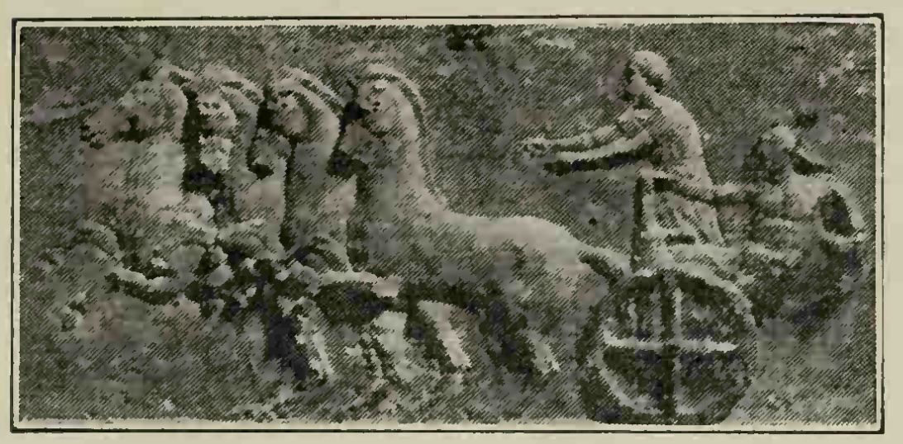
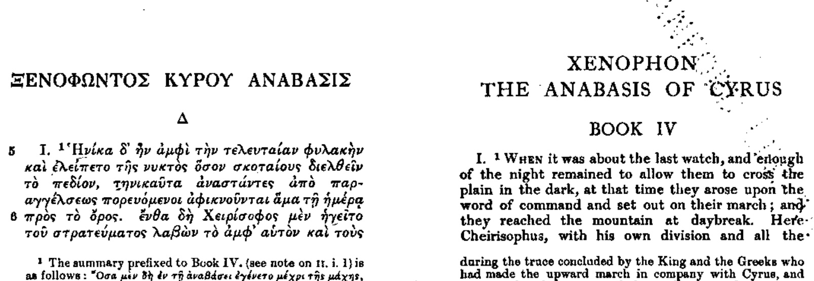
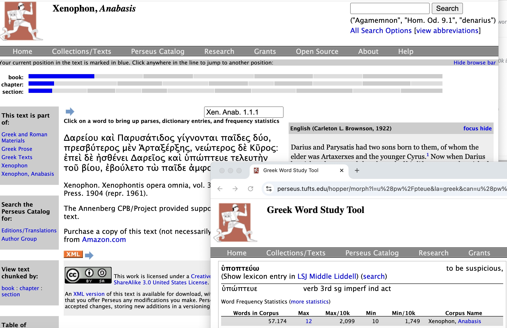
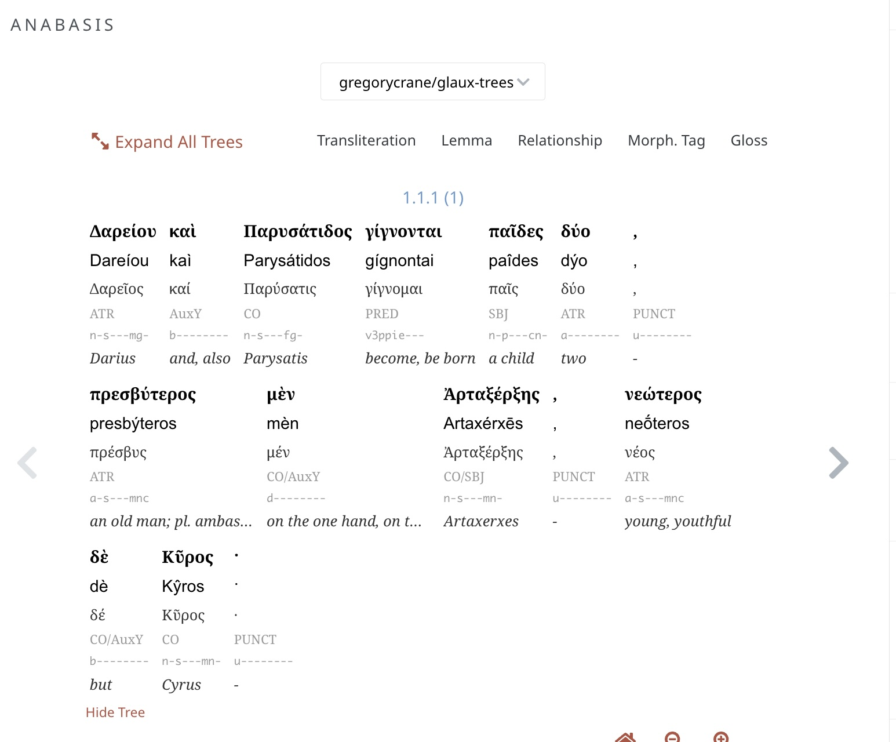

<head>Introduction</head>

|  |  | 

**Eager to Go**: Pedestal of the monument dedicated to the victory of Krates in the Apobates (literally,"the person who gets off") race at the Panathenaic Games. A fully armed soldier jumps on and off a moving chariot. The image above is a marble relief from the fourth century BCE and is at the Acropolo Athens, Greece. The original image and more information are available from  [Egisto Sani on Flickr](https://www.flickr.com/photos/69716881@N02/32099864256). See also the Wikipedia article on this object ([Acropolis 1326](https://www.perseus.tufts.edu/hopper/artifact?name=Athens,+Acropolis+1326&amp;object=Sculpture)), which is known as the [Apobates base.](https://en.wikipedia.org/wiki/Apobates_Base)  

## [§ pref02](#parapref02). This course

This book provides a hybrid approach to learning Ancient that integrates traditional methods with the capabilities provided by digital media. In print culture, readers of ancient languages depended upon static texts that coud not explain themselves.
This book provides a hybrid approach to learning Ancient that integrates traditional methods with the capabilities provided by digital media. In print culture, readers of ancient languages depended upon static texts that coud not explain themselves.

>  Δαρείου καὶ Παρυσάτιδος γίγνονται παῖδες δύο, πρεσβύτερος μὲν Ἀρταξέρξης, νεώτερος δὲ Κῦρος· ἐπεὶ δὲ ἠσθένει Δαρεῖος καὶ ὑπώπτευε τελευτὴν τοῦ βίου, ἐβούλετο τὼ παῖδε ἀμφοτέρω παρεῖναι. 
>> [Xenophon, Anabasis 1.1.1](https://beyond-translation.perseus.org/reader/urn:cts:greekLit:tlg0032.tlg006.perseus-grc2:1.1.1-1.1.5)

The state of the art of large-scale assisted reading for Greek and Latin in print culture was side-by-side translation, as in the Loeb Classical Library.

In the early 1990s, the Perseus Digital Library added the ability to generate analyses for each word in the text and links to one or more online dictionaries.

A major new generation of Perseus adds rich linguistic annotation for syntax and other featurs.

You can hack your way through texts in a language that you do not know. But the more you understand about the language to start with, the more you can get out of the automated tools. These new reading environments allow you do to more at an earlier stage of learning but they also enhance your ability to understand the language no matter how much you know. You can exploit automated tools to avoid learning but you can use tools can, if you used well, deepen your understanding of a language.

## [§ pref02](#parapref02). The Greek Alphabet

[The following table is based on that of [Thomas Dwight Goodell' School Grammar for Greek](https://dcc.dickinson.edu/grammar/goodell/alphabet).]

| Letter |  | Sound | Name |  | 
| --- | --- | --- | --- | --- 
| Α | α | a in far | ἄλφα | alpha | 
| Β | β | b | βῆτα | beta | 
| Γ | γ | g in go | γάμμα | gamma | 
| Δ | δ | d | δέλτα | delta | 
| Ε | ε | ĕ in met | εἶ / ἒ ψῑλόν | epsilon | 
| Ζ | ζ | dz | ζῆτα | zeta | 
| Η | η | a as in ace | ἦτα | eta | 
| Θ | θ | th in thin | θῆτα | theta | 
| Ι | ι | ῐ as in brick; ῑ as in creek | ἰῶτα | iota | 
| Κ | κ | k | κάππα | kappa | 
| Λ | λ | l | λάμβδα | lambda | 
| Μ | μ | m | μῦ | mu | 
| Ν | ν | n | νῦ | nu | 
| Ξ | ξ | ks | x in wax | ξεῖ | 
| Ο | ο | ŏ in obey | οὖ / ὂ μῑκρόν | omicron | 
| Π | π | p | πεῖ | πῖ | pei / pi | 
| Ρ | ρ | r | ῥῶ | rho | 
| Σ | σ, ς | s in see | σίγμα | sigma | 
| Τ | τ | t in to | ταῦ | tau | 
| Υ | υ | u | German ü | ὖ | ὖ ψῑλόν | upsilon | 
| Φ | φ | ph in Philip | φεῖ | φῖ | phei / phi | 
| Χ | χ | German ch | χεῖ | χῖ | chei / chi | 
| Ψ | ψ | ps | ψεῖ | ψῖ | psei / psi | 
| Ω | ω | ō | ὦ | ὦ μέγα | omega | 

Greek contains five diacritics.

Three of these describe pitch:

| Accent | Example | 
| --- | --- 
| acute -- a rising tone | ποταμός | 
| grave -- a sinking tone | ποταμὸς | 
| circumflex -- a tone that rises and falls | Κῦρον | 

The other two diacritics tell you whether or not a word beginning with a vowel has an 'h.' Greek ceased to use the letter 'h.' To show whether a word is aspirated (starts with an 'h') it uses what are called breathing marks.

| Greek | Translit. | 
| --- | --- 
| "rough" breathing (with an 'h') | ὁ | ho | 
| "smooth" breathing (no 'h') | ἀπὸ | apo | 

The breathing marks are often very hard to make out on a computer screen. In practice, we should only show one breathing mark (i.e., for either rough or smooth) but that is not how Greek texts are printed.

Words from the opening of Xenophon's March Upcountry (Anabasis):

| Greek | new letters | 
| --- | --- 
| ὁ | ['ο'] | 
| μὲν | ['μ', 'ε', 'ν'] | 
| οὖν | ['υ'] | 
| πρεσβύτερος | ['π', 'ρ', 'σ', 'β', 'τ', 'ς'] | 
| παρὼν | ['α', 'ω'] | 
| ἐτύγχανε: | ['γ', 'χ'] | 
| Κῦρον | ['Κ'] | 
| δὲ | ['δ'] | 
| μεταπέμπεται | ['ι'] | 
| ἀπὸ | [no new letters] | 
| τῆς | ['η'] | 
| ἀρχῆς | [no new letters] | 
| ἧς | [no new letters] | 
| αὐτὸν | [no new letters] | 
| σατράπην | [no new letters] | 
| ἐποίησε, | [no new letters] | 
| καὶ | ['κ'] | 
| στρατηγὸν | [no new letters] | 
| δὲ | [no new letters] | 
| αὐτὸν | [no new letters] | 
| ἀπέδειξε | ['ξ'] | 
| πάντων | [no new letters] | 
| ὅσοι | [no new letters] | 
| ἐς | [no new letters] | 
| Καστωλοῦ | ['λ'] | 
| πεδίον | [no new letters] | 
| ἁθροίζονται. | ['θ', 'ζ'] | 
| ἀναβαίνει | [no new letters] | 
| οὖν | [no new letters] | 
| ὁ | [no new letters] | 
| Κῦρος | [no new letters] | 
| λαβὼν | [no new letters] | 
| Τισσαφέρνην | ['Τ', 'φ'] | 
| ὡς | [no new letters] | 
| φίλον, | [no new letters] | 
| καὶ | [no new letters] | 
| τῶν | [no new letters] | 
| Ἑλλήνων | ['Ε'] | 
| ἔχων | [no new letters] | 
| ὁπλίτας | [no new letters] | 
| ἀνέβη | [no new letters] | 
| τριακοσίους, | [no new letters] | 
| ἄρχοντα | [no new letters] | 
| δὲ | [no new letters] | 
| αὐτῶν | [no new letters] | 
| Ξενίαν | ['Ξ'] | 
| Παρράσιον. | ['Π'] | 

