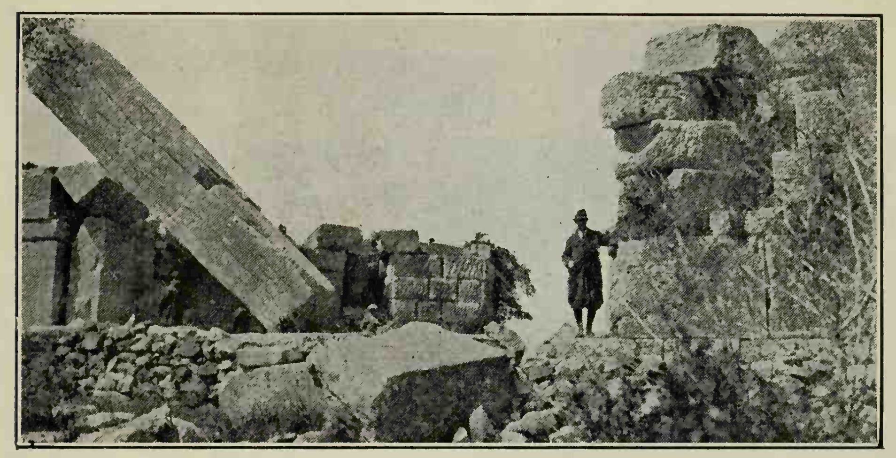

# Chapter 2: DECLENSION OF O-STEMS — Continued

>  πόνος γάρ, ὡς λέγουσιν, εὐκλείας πατήρ. 
>  Toil, so they say, is the father of fame. 
>> Euripides, fragment

## [§ 8](#para8). Persistent Accent.

The accent of the nominative
must be learned by observation. It will remain on the
same syllable in the other cases if possible.

An acute on
the penult of a noun of the o-declension remains on that
syllable throughout. 

An acute on the antepenult is drawn
to the penult when the ultima is long (§ V, e). Final -οι
of the nominative plural is considered short (§ V, a).

| Greek | English | 
| --- | -- | 
|  ὁ φίλος  |  the friend  |

| Greek | English | 
| --- | -- | 
|  ὁ δίκαιος   |  the just man  |

In like manner inflect ὁ πόλεμος.

2 In the previous lesson you found singular and plural labeled. From now on you are given no labels, bnt you can readily tell which is which.
3 As in Latin, adjectives agree with their nouns in gender, number, and case.

<pb n="5"/>

## [§ 9](#para9). Genitive of Place from Which.

 The genitive with
many prepositions denotes place from which :<note>This is our second use of the genitive (§ 4). The use here given is like the Latin ablative in its from relations.</note>

| Greek | English | 
| --- | -- | 
|  τὸν ἄνθρωπον πέμπει ἀπὸ τοῦ ποταμοῦ.  |  he sends the man from the river.  |
|  τὸν ἄνθρωπον πέμπει ἐκ τοῦ ποταμοῦ.  |  he sends the man out of the river.  |

|  |  | 

<figure><head>The ARCADIAN GATE</head>

The walls of Messene still testify to the engineering skill and daring of the
victor of Leuctra. Note particularly the central doorpost of this great gate.
It is nearly nineteen feet long.</figure>

## [§ 10](#para10). Vocabulary

**ἄνθρωπος**, ἀνθρώπου, ὁ: person, human being. When used with the feminine article, this noun can explicitly designate a female person. Lat. homo. ANTHROPOLOGY

**ἄξιος**: worthy, worth. AXIOM

**ἀπό**: prep. with G.: from, away from, Lat. ab. APOSTLE.

**δίκαιος** : just.

**Ἑλλήσποντος**, Ἑλλησπόντου, ὁ: Hellespont, the Dardanelles.

**ἐκ**: (before consonants), ἐξ (before vowels), proclit. prep. with G. out of, from. Lat. ex. ECLECTIC.

**μακρός**: large. MACRON. MACROECONOMICS.

**μῑκρός**: small. MICROSCOPIC. MICROECONOMICS

**πόλεμος**: war.

**πολέμιος** : hostile. οἱ πολέμιοι: the enemy. POLEMIC.

**φίλος**: friend. PHILANTHROPIST.

2 Adjectives in -ρος usually have the acute on the last syllable.

<pb n="6"/>

TRANSLATION HINTS

. Learn all words given in vocabularies.

. Learn all forms as they are presented.

. Read the Greek aloud, noting word groups.

. Translate.

EXERCISES

<figure><head>Pericles</head>

The most brilliant period in Athenian history is justly called the Age
of Pericles. His home was the haunt
of sculptor and architect, poet and
philosopher. To him we owe above
all the planning and construction of
the matchless Parthenon.</figure>

(a) Translate :

1. τοὺς πολεμίους παύουσιν.1
2. τὸν ἄνθρωπον πέμπει ἀπὸ τοῦ Ἑλλησπόντου.
3. οἱ ἀδελφοὶ ἦσαν μῑκροί.
4. τοὺς φίλους πέμπουσιν1 ἐκ τοῦ ποταμοῦ.
5. ὁ πόλεμος ἦν δίκαιος.
6. οἱ πολέμιοι ἀξίους στρατηγοὺς ἔχουσιν.
7. ὁ στρατηγὸς τοὺς ἀνθρώπους πέμπει τῷ ἀδελφῷ.
8. οἱ ἄνθρωποι ἔχουσιν ἀξίους ἀδελφούς.

(b) Complete:

1. οἱ πολεμ--- ἦσαν μακρ---.
2. τὸν ἀδελφ-- πέμπει ἐκ τ--- ποταμ- (singular).
3. οἱ στρατηγοὶ τοὺς φίλους πεμπ-- τῷ ἀνθρωπ--.

<pb n="7"/>

